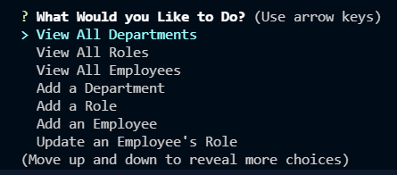

## Challenge Twelve SQLEmployeeTracker

### Description

The challenge this week was to integrate SQL Databases within a framework of Inquirer promting the user for options, and then retrieving the requested info or promting them with further questions also using Inquirer. SQL queries were then used in conjunction with these responses to retrieve and print the desured information. 

The SQL database was initially set up with tables for the departments, roles within the company, and employees. It was also seeded with initial data to make the demonstration process easier as you will see in the linked demo. 

This code also contains modularized code, with the functions being separated into their own function within a class in functions.js and a separate connection.js file to establish a connection with the database. Initially this was done all in index.js but was later reformated to make the code more efficient and readable. 

### Screenshots

To invoke the index.js file, type the following into the command line

You will then be presented with a series of prompts if everything is installed and has been run correctly. From here select any option. 

### Links

Github: [Link](https://github.com/LoganDufek/SQLEmployeeTracker)
YouTube:[Link](https://www.youtube.com/watch?v=71QrDCllxak)